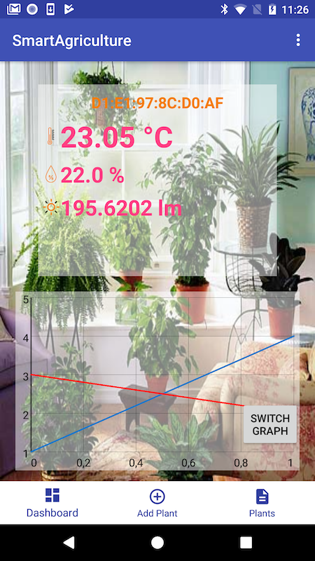

# smartAgriculture
This android application is developed for home plants. Ruuvitag sensors are used to collect temperature and air humidity data. When the environmental temperature and air humidity is not suitable for a particular plant, the app sends a notification to the user to change plant position. The app is developed with basic features and it needs future work such as plant database for information.

